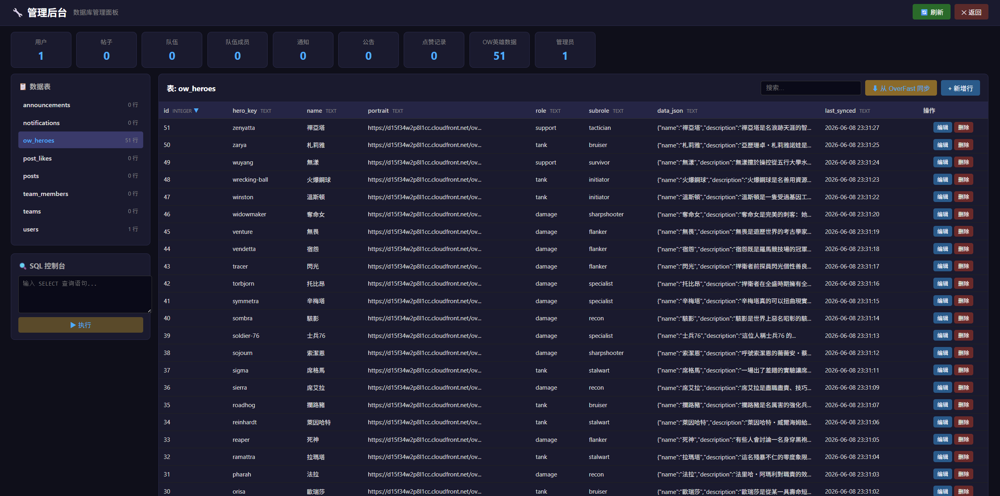

# Overwatch Gaming - 论坛模板


这是一个以守望先锋为主题的基于 Vue 3 + Express + SQLite 的轻量级论坛模板，专为快速搭建社区系统设计。


[点击此处查看模板网站](http://owbbs.omaekumiko529.online/)

该模板支持完整的帖子线程模型、JWT 认证、通知系统和后台管理面板，可直接用于二次开发或学习全栈架构。此项目使用 MIT 许可证开源。public 目录下包含的守望先锋相关美术资源（英雄职责图标）来自第三方的版权财产，仅供演示用途，不适用 MIT 许可证，商业使用或再分发需要用自有素材替换。

## 技术栈

前端基于 Vue 3 构建，搭配 Vue Router 4 做客户端路由（Hash 模式）、Pinia 管理全局状态。构建工具选用 Vite 7，生产构建时 base 路径设为 /Overwatch-Gaming/ 以适配 GitHub Pages 的子路径部署。开发环境下 Vite 将 /api 请求代理到 localhost:3001 的 Express 后端。

后端使用 Express 4 搭建 RESTful API，sql.js 实现 SQLite 数据库的读写与持久化（WebAssembly 编译的 SQLite，无需安装数据库服务），bcryptjs 做密码哈希，jsonwebtoken 签发 JWT 认证令牌，express-rate-limit 对敏感接口施加频率限制。项目早期依赖 Supabase 作为后端服务，经过一次数据迁移后改为自建的 Express + SQLite 架构，相关迁移逻辑实现在 server/migrate-v2.js 和 tools/migrate-localstorage.js 中。


## 项目文件结构

```
Overwatch-Gaming/
├── public/                    # 静态资源
│   ├── favicon.ico            # 网站图标
│   ├── 96px-职责：输出_图标.webp
│   ├── 96px-职责：支援_图标.webp
│   ├── 96px-职责：重装_图标.webp
│   ├── Head.png
│   ├── Heading.png
│   ├── ow_icon.svg
│   ├── SmileySans-Oblique.ttf
│   ├── MapleMono-CN-Regular.ttf
│   ├── 默认头图设计.psd
│   ├── 职责专题页面参考.psd
│   ├── migrate.html
│   └── Nsc/
├── src/                       # 前端源代码
│   ├── App.vue                # 根组件
│   ├── main.js                # 应用入口
│   ├── router/index.js        # 路由配置（Hash 模式，含懒加载与守卫）
│   ├── components/            # 可复用组件
│   │   ├── NavBar.vue
│   │   ├── SearchInput.vue
│   │   ├── RichTextEditor.vue
│   │   ├── UserrankBadge.vue
│   │   ├── Popup.vue
│   │   ├── MentionExtension.js
│   │   ├── BilibiliNode.js
│   │   └── GitNode.js         # Git 仓库嵌入 TipTap 节点
│   ├── pages/                 # 页面级组件
│   │   ├── HomePage.vue
│   │   ├── LoginPage.vue
│   │   ├── RegisterPage.vue
│   │   ├── UserPanel.vue
│   │   ├── BrowsePage.vue
│   │   ├── SearchPage.vue
│   │   ├── CreatePostPage.vue
│   │   ├── PostDetailPage.vue
│   │   ├── NotificationPage.vue
│   │   ├── AnnouncementPage.vue
│   │   ├── AdminPanel.vue
│   │   ├── HeroesPage.vue
│   │   ├── GeneratePage.vue   # 数据生成器（管理员）
│   │   ├── ErrorPage.vue
│   │   └── HomePages/
│   │       ├── HeroSection.vue
│   │       ├── RolesSection.vue
│   │       ├── SupportGallery.vue
│   │       └── BlankSection.vue
│   ├── UserPanel/
│   │   ├── ProfileHeader.vue
│   │   ├── OverviewTab.vue
│   │   ├── PostsTab.vue
│   │   ├── TeamTab.vue
│   │   ├── SettingsTab.vue
│   │   └── modals/
│   ├── services/              # API 调用封装
│   │   ├── api.js             # 11 组 API 封装
│   │   ├── auth.js
│   │   ├── post.js
│   │   ├── user.js
│   │   ├── preference.js      # 偏好记录与排序服务
│   │   └── notification.js
│   ├── stores/                # Pinia 状态仓库
│   │   ├── auth.js
│   │   ├── post.js
│   │   ├── team.js
│   │   ├── popup.js
│   │   └── notification.js
│   ├── utils/
│   │   ├── auth.js
│   │   ├── encode.js
│   │   ├── mentionParser.js
│   │   ├── contentFilter.js   # 内容过滤器（BV/Git 标签渲染）
│   │   └── pop.js
│   ├── constants/
│   │   ├── rankMap.js
│   │   └── popupStyles.json
│   ├── composables/
│   └── types/fullpage.d.ts
├── server/                    # 后端源代码
│   ├── index.js               # Express 服务入口（含 ASCI 启动动画）
│   ├── db.js                  # 数据库初始化与工具函数（OmaeSQL 核心）
│   ├── migrate-v2.js          # 数据迁移脚本
│   ├── check_db.js
│   ├── setup-env.js           # 交互式 .env 配置引导
│   ├── package.json
│   ├── middleware/auth.js     # JWT 认证中间件（auth / optionalAuth / adminMiddleware）
│   ├── routes/
│   │   ├── auth.js
│   │   ├── posts.js
│   │   ├── teams.js
│   │   ├── notifications.js
│   │   ├── announcements.js
│   │   ├── admin.js
│   │   ├── heroes.js
│   │   ├── migrate.js
│   │   ├── preference.js      # 个性化偏好
│   │   ├── seed.js            # 种子数据注入
│   │   └── git.js             # Git 仓库信息
│   └── utils/identifiers.js
├── tools/
│   ├── migrate-localstorage.js
│   ├── seed-data.json         # 种子数据定义
│   ├── generate-seed.js
│   └── append-seed.js
├── vite.config.js
├── index.html
├── package.json
├── jsconfig.json
├── test_auth.html
└── test_admin_login.js
```

## 前后端 API 通信架构

### 整体链路

```
浏览器 (Vue 3)
    │
    │  src/services/api.js 统一封装 fetch 客户端
    │  自动从 localStorage/sessionStorage 读取 JWT token
    │  注入 Authorization: Bearer <token> 请求头
    │
    ▼
  开发环境: Vite dev server (:5173)
    │  vite.config.js proxy: /api → http://localhost:3001
    │
    ▼
  生产环境: 静态文件服务器 (GitHub Pages)
    │  前端 dist/ + 独立部署的 Express 后端
    │
    ▼
Express Server (:3001)
    │  server/middleware/auth.js 校验 JWT
    │  authMiddleware / optionalAuth / adminMiddleware
    │
    ▼
  server/db.js (OmaeSQL)
    │  sql.js (WebAssembly SQLite)
    │  8 张业务表 + 索引 + WAL 模式 + 防抖写入
    │
    ▼
  server/routes/*.js
    │  按领域拆分的路由模块（共 11 个路由文件）
    │  每个路由文件自包含：参数校验 → SQL 操作 → 响应格式化
    │
    ▼
  前端 Pinia stores
    │  调用 service 层函数 → 驱动 Vue 组件响应式更新
```

### 认证闭环

1. **登录** → 后端签发 JWT（30天有效期），返回 token
2. **存储** → 前端根据 "记住我" 选项写入 localStorage 或 sessionStorage
3. **注入** → `api.js` 中 `request()` 函数自动从存储读取 token，注入 `Authorization` 头
4. **校验** → 后端 `authMiddleware` 解析 JWT，挂载 `req.user`
5. **续期** → 401 响应触发前端清除本地会话，跳转登录页

### 可选认证模式

- `auth: true` → 必选认证，无 token 时返回 401
- `auth: 'optional'` → 可选认证，有 token 就解析用户信息，无 token 则继续
- 未标记 → 公开接口，无需认证

## SQL 数据库设计与规划




### 表结构概览
项目共包含 **8 张业务表**，统一在 `server/db.js` 的 `initSchema()` 中创建：

#### 1. users — 用户账户
```sql
CREATE TABLE users (
  id            INTEGER PRIMARY KEY AUTOINCREMENT,
  username      TEXT NOT NULL UNIQUE,
  email         TEXT NOT NULL UNIQUE,
  password_hash TEXT NOT NULL,
  role          TEXT NOT NULL DEFAULT '["flexible"]',   -- JSON 数组，如 ["damage","support"]
  is_admin      INTEGER NOT NULL DEFAULT 0,
  uid           TEXT UNIQUE,
  userrank      INTEGER NOT NULL DEFAULT 0,
  avatar        TEXT NOT NULL DEFAULT '/Head.png',
  team_id       INTEGER,
  preference    TEXT NOT NULL DEFAULT '{"total":0}',    -- 偏好标签 JSON
  created_at    TEXT NOT NULL DEFAULT (datetime('now','localtime')),
  updated_at    TEXT NOT NULL DEFAULT (datetime('now','localtime'))
)
```

#### 2. posts — 帖子与评论（线程模型核心）
```sql
CREATE TABLE posts (
  id         INTEGER PRIMARY KEY AUTOINCREMENT,
  user_id    INTEGER NOT NULL,
  username   TEXT NOT NULL,
  title      TEXT NOT NULL,
  content    TEXT NOT NULL,
  category   TEXT NOT NULL DEFAULT 'general',
  likes      INTEGER NOT NULL DEFAULT 0,
  views      INTEGER NOT NULL DEFAULT 0,               -- 浏览量
  context    TEXT DEFAULT '#',
  parent_id  INTEGER,
  pid        TEXT UNIQUE,
  postrank   TEXT NOT NULL DEFAULT '69',
  mentions   TEXT DEFAULT '[]',
  tags       TEXT NOT NULL DEFAULT '[]',                -- 标签数组
  created_at TEXT NOT NULL DEFAULT (datetime('now','localtime')),
  updated_at TEXT NOT NULL DEFAULT (datetime('now','localtime'))
)
```

其余表结构（teams、team_members、notifications、announcements、post_likes、ow_heroes）详见 [Database.md](docs/Database.md)。

## 模板化模块 — OmaeSQL 与 KUMIKO Server

该项目实质上是一个可拆解复用的模板，每个核心模块都能独立嵌入到其他开发者的代码库中。

### OmaeSQL — 零依赖 SQLite 数据库包装器

Omae SQL是一个完整封装的 SQLite 数据库工具层，基于 sql.js（WebAssembly 编译的 SQLite，无需安装数据库服务），开箱即用。

**导出 API**：

| 函数 | 用途 |
|------|------|
| `getDb()` | 初始化数据库连接（加载/创建 data.db，运行 schema） |
| `getOne(sql, params)` | 查询单行 → 返回对象 |
| `getAll(sql, params)` | 查询多行 → 返回对象数组 |
| `run(sql, params)` | 执行写操作 → 返回 `{ changes }` |
| `insert(sql, params)` | 插入并返回 `{ lastInsertRowid, changes }` |
| `transaction(fn)` | 事务包裹函数，自动 BEGIN/COMMIT/ROLLBACK |
| `getValue(sql, params)` | 获取单个标量值 |
| `saveDb()` | 手动强制持久化到磁盘 |

**主要功能**：
- 自动防抖持久化（300ms 延迟，避免频繁 I/O）
- WAL 模式 + 外键约束
- 增量迁移机制（PRAGMA table_info → ALTER TABLE）兼容旧数据结构
- 优雅的写失败处理（不抛异常，保证内存状态可用）

**拆解复用**：只需复制 `server/db.js`，调用 `getDb()` 即可在任何 Node.js 项目中获得完整的 SQLite 读写能力，无需安装数据库服务或配置任何东西。

### KUMIKO Server - 模块化 Express REST 框架

**定位**：`server/` 整体是一个可复用的后端框架，将常见社区/论坛类系统的后端逻辑按领域拆分为独立模块。

**模块组成**：

| 模块 | 路径 | 功能 |
|------|------|------|
| 认证模块 | `routes/auth.js` | 注册/登录/信息获取/密码修改/权限提升 |
| 内容模块 | `routes/posts.js` | 帖子/评论 CRUD、点赞、帖子标记 |
| 队伍模块 | `routes/teams.js` | 战队创建/加入/退出 |
| 通知模块 | `routes/notifications.js` | 通知存取/已读标记 |
| 公告模块 | `routes/announcements.js` | 公告 CRUD |
| 管理模块 | `routes/admin.js` | 通用数据库 CRUD 面板、SQL 查询 |
| 英雄模块 | `routes/heroes.js` | OverFast API 数据同步与查询 |
| 偏好模块 | `routes/preference.js` | 用户偏好记录与获取 |
| 种子模块 | `routes/seed.js` | 测试数据注入（管理员） |
| Git 模块 | `routes/git.js` | GitHub/Gitee 仓库信息获取 |
| 中间件 | `middleware/auth.js` | JWT 签发、认证校验、管理员权限校验 |

**框架特性**：
- 三个认证层级：`authMiddleware`（必选）、`optionalAuth`（可选）、`adminMiddleware`（管理员）
- 频率限制：全局 + 每个路由的精细限流配置
- CORS 白名单
- 全局错误处理
- `.env` 配置引导

**如何拆解复用**：需要后端场景时，复制 `server/` 目录，按需保留或删减 `routes/` 下的模块，通过 `app.use('/api/模块名', router)` 挂载即可。

## API 接口

### 认证

| 方法 | 路径 | 认证 | 说明 |
|------|------|------|------|
| POST | /api/auth/register | 无 | 注册，每小时限3次 |
| POST | /api/auth/login | 无 | 登录，每分钟限5次 |
| GET | /api/auth/me | 必需 | 获取当前登录用户信息 |
| GET | /api/auth/users | 无 | 获取所有用户列表（邮箱脱敏） |
| GET | /api/auth/users/:uid | 无 | 获取单个用户 |
| PUT | /api/auth/update | 必需 | 更新 email/avatar/username |
| PUT | /api/auth/role | 必需 | 更新守望先锋职责偏好 |
| PUT | /api/auth/promote | 必需(Admin) | 提升目标用户等级 (0-3) |
| PUT | /api/auth/password | 必需 | 修改密码，需验证旧密码 |
| DELETE | /api/auth/delete | 必需 | 删除当前用户账号 |

### 帖子

| 方法 | 路径 | 认证 | 说明 |
|------|------|------|------|
| GET | /api/posts | 可选 | 帖子列表，支持 search/category/postrank/popular/limit |
| GET | /api/posts/:pid | 可选 | 帖子详情，含子帖树，带 isLikedByUser |
| GET | /api/posts/user/:uid | 无 | 查询指定用户的帖子 |
| GET | /api/posts/categories/list | 无 | 返回所有帖子分类 |
| POST | /api/posts | 必需 | 创建主帖（支持 tags 标签） |
| POST | /api/posts/:pid/comment | 必需 | 评论帖子 |
| POST | /api/posts/:pid/like | 必需 | 去重点赞（含事务） |
| DELETE | /api/posts/:pid/like | 必需 | 取消点赞（含事务） |
| PUT | /api/posts/:pid | 必需 | 更新帖子（仅帖主） |
| PUT | /api/posts/:pid/rank | 必需(Admin) | 设置帖子标记 (FF/69/78/00) |
| DELETE | /api/posts/:pid | 必需 | 删除帖子及所有子帖 |

### 队伍 / 通知 / 英雄 / 公告 / 管理

详见 [API-Reference.md](docs/API-Reference.md)。

### 新增 API

#### Git 仓库

| 方法 | 路径 | 认证 | 说明 |
|------|------|------|------|
| POST | /api/git/fetch | 无 | 获取 GitHub/Gitee 仓库信息及贡献者 |

#### 个性化偏好

| 方法 | 路径 | 认证 | 说明 |
|------|------|------|------|
| POST | /api/preference/record | 必需 | 记录用户浏览帖子的标签偏好 |
| GET | /api/preference/:uid | 无 | 获取用户偏好数据 |

#### 种子数据

| 方法 | 路径 | 认证 | 说明 |
|------|------|------|------|
| POST | /api/seed/inject | 必需(Admin) | 注入测试用户和帖子数据 |

## 设计思路

### **帖子系统的线程模型**

所有帖子和评论共用一张 posts 表，通过 parent_id 区分主帖和子帖，通过 context 字段存储嵌套路径。context 的格式类似于 `#/p-xxx/u-yyy/u-zzz`，查询时通过 LIKE 匹配即可一次性取出一条主帖下的所有子帖，不需要递归查询。每个帖子拥有唯一的 PID 标识符（格式如 `p-20260105-a1b2`），直接作为 URL 参数使用，避免暴露自增数字 ID。

### **帖子标记与权限分级**

该功能受VRChat的启发制作而成。postrank 字段定义了四个等级：FF 为红帖，需要 userrank >= 1 才能评论；69 为普通帖，无额外限制；78 为绿帖；00 为黑帖，仅 userrank >= 2-3 的管理员可以查看内容。用户等级体系：0=访客、1=玩家、2=受信任玩家、3=管理员。前端路由守卫和后端中间件双重校验确保了权限的严格执行。

### **点赞事务机制**

点赞和取消点赞操作使用 BEGIN TRANSACTION / COMMIT / ROLLBACK 包装，同时操作 post_likes 表和 posts.likes 计数，保证数据一致性。post_likes 表通过 UNIQUE(post_id, user_id) 约束实现去重。

### **管理员通用 CRUD 面板**

GET /api/admin/tables 遍历 SQLite 系统表列出所有用户表及其列结构。GET /api/admin/table/:tableName 提供分页、排序和搜索能力，通过 PRAGMA table_info 动态获取列信息，password_hash 自动脱敏。POST、PUT、DELETE 对应同一端点的增删改，所有操作都限定在一个表名白名单（7张表）和自增主键排除机制之内。POST /api/admin/sql 支持执行只读的 SELECT 和 PRAGMA 查询，通过关键字黑名单和正则校验防止注入。

### **标识符系统**

UID 和 PID 由 server/utils/identifiers.js 生成，格式为 `u-{日期}-{随机字符}` 和 `p-{日期}-{随机字符}`，不依赖数据库自增 ID。各业务接口都同时支持 UID 字符串和数字 ID 两种查找方式以兼容迁移数据。

#### **数据库兼容性**

users 和 posts 表的 initSchema 函数在创建表后通过 PRAGMA table_info 检查列的存量，对缺失的列执行 ALTER TABLE 补充（包括较新添加的 preference、views、tags 字段）。

### **富文本编辑器与 Bilibili 视频嵌入**

帖子编辑器使用 TipTap 富文本编辑器，支持 @提及用户（自动补全弹窗），以及嵌入 Bilibili 视频（通过自定义 BilibiliNode 节点解析 BV/AV/EP 号），以及嵌入 GitHub/Gitee 仓库信息卡片（GitNode 节点）。编辑器内置的 Git 仓库嵌入功能通过后端 API 获取仓库元数据，以卡片形式展示仓库名称、平台和贡献者。

### **全站弹窗系统**

Popup.vue 组件配合 popup.js 工具和 popupStyles.json 样式配置，提供统一的弹窗管理方案，支持多种样式主题。

### **个性化推荐系统（新增）**

系统通过记录用户浏览帖子的标签偏好，实现基于兴趣的帖子排序推荐。数据存储在 `users` 表的 `preference` 字段中，排序算法为：每个标签的权重 = 该标签浏览次数 / 总次数，帖子得分 = 所有命中标签的权重之和。按得分降序排列，实现个性化内容展示。

### **内容过滤器与特殊标签渲染**

`src/utils/contentFilter.js` 对帖子内容进行安全过滤和后处理，支持将 `<bv>BVxxx</bv>` 渲染为 Bilibili 嵌入式视频、将 `<git data-*></git>` 渲染为 Git 仓库信息卡片。这两个标签由 TipTap 编辑器在发帖时自动插入。

### **种子数据生成器（新增）**

管理员可通过 `/generate` 页面或 API 一键注入测试数据（用户 + 帖子）。种子数据定义在 `tools/seed-data.json` 中，支持重复数据保护（已存在的用户名/标题自动跳过）。

## Git 分支

项目共维护了六个本地分支和四个远程分支。`main`与`fmy-dev`分支是稳定版本，拥有完整的提交历史。`dev` 分支汇合了正在开发的功能。`test` 与 `lyd-dev` 分支存放实验性设计（例如角色展示页面和 Pinia 重构尝试），这些分支可能存在未完成的 Bug。

## 安装与运行

环境要求 Node.js 20.19 或 22.12 以上版本，以及 npm。克隆仓库后按以下步骤操作：

```bash
# 安装前端依赖
npm install

# 安装后端依赖
cd server
npm install
cd ..
```

开发时需要同时启动两个终端：

```bash
# 终端 1：启动 Vite 前端开发服务器（默认 5173 端口）
npm run dev

# 终端 2：启动 Express API 服务器（默认 3001 端口）
cd server
npm run dev
```
如果你是第一次启动开发服务器，服务器会要求你输入`.env`文件的配置信息，内容主要包含Admin密码与.db通用密钥：
```
     ___       ___       ___       ___       ___       ___            ___       ___       ___   
    /\__\     /\__\     /\__\     /\  \     /\__\     /\  \          /\  \     /\  \     /\  \  
   /:/ _/_   /:/ _/_   /::L_L_   _\:\  \   /:/ _/_   /::\  \        /::\  \   /::\  \   _\:\  \ 
  /::-"\__\ /:/_/\__\ /:/L:\__\ /\/::\__\ /::-"\__\ /:/\:\__\      /::\:\__\ /::\:\__\ /\/::\__\
  \;:;-",-" \:\/:/  / \/_/:/  / \::/\/__/ \;:;-",-" \:\/:/  /      \/\::/  / \/\::/  / \::/\/__/
   |:|  |    \::/  /    /:/  /   \:\__\    |:|  |    \::/  /         /:/  /     \/__/   \:\__\  
    \|__|     \/__/     \/__/     \/__/     \|__|     \/__/          \/__/               \/__/


欢迎使用KUMIKO API服务接口
回车以使用默认配置
```

生产构建：

```bash
npm run build
```

将生成的 dist 目录部署到任意静态文件服务器即可。后端通过 `npm start` 启动。

## 许可证

项目源代码根据 MIT 许可证授权。public/ 目录中包含从第三方版权财产中提取的示例资源材料（包括英雄职责图标、PSD 设计文件、背景视频等），仅供演示之用，不受 MIT 许可证保护。如果计划移植、重新分发或商业使用此项目，必须用自己的资产替换这些受版权保护的材料。部分代码和素材包含 AI 生成内容，请仔细鉴别并自行规避相关法律风险。详情请参阅根目录下的 LICENSE 文件。

## 一些感想

开发这个项目的起因是我有一门关于 HTML 设计与制作的大学课程，授课的老师喋喋不休地讲那些我已经完全掌握了的基础知识。我知道没做作业确实不对，但我的能力已经超出了这门课程的范畴，所以索性提前开始做期末作业，也就是这个网站，想向老师证明我已经不需要再听这些内容了。

我之前学过 Vue，但这是我第一个主要使用 Vue 的前端项目。在这个过程里我接触到了很多原本属于后端范畴的知识，比如 Supabase 和基础的 SQL。从这个角度看，这门课程也让我受益匪浅。这也是我第一次尝试用 Git 做团队开发，所以你可能看到有很多分支还没有合并到主分支。dev 分支是正在开发的功能，几个不同编写者写了不同的部分，以后会逐步整合到 main 上；test 分支是未来可能加入的设计，比如把整个本地服务器迁移到 Supabase 上。test 分支通常或多或少有 Bug，有的是我懒得修就丢进去了，有些是我还没掌握那部分知识，所以暂时搁置了。

另外，这也是一个我想要拆分成多个npm包的项目，其中有很多内容是没有别人做过的，当然有些也只是我自己的奇思妙想。不过别担心，如果条件允许我应该会写很多个包体，因为我自己的全栈开发也时常用到这些功能，尤其是`KUMIKO Server`

总之这是一个还不完善的项目，但 `main` 和 `dev` 分支已经可以在编译环境下正常工作。你完全可以把这两个分支的代码用于微信小程序或者独立的前端页面之上。

另外提一下，我没有打包 `Amiya.mp4` 和 `Amiya2.mp4` 这两个背景视频文件到仓库里，所以你第一次编译会报错，提示你缺失了这两个文件。这是因为它们太大了，GitHub仓库接收不了。如果你需要这两个视频，可以去该项目的GitHub Pages页面下载，或者用自己的视频替代；当然你可以自己重新设计样式，这些都没问题。